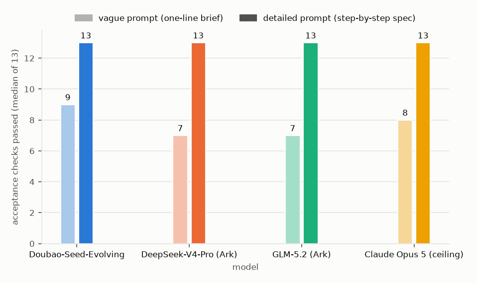
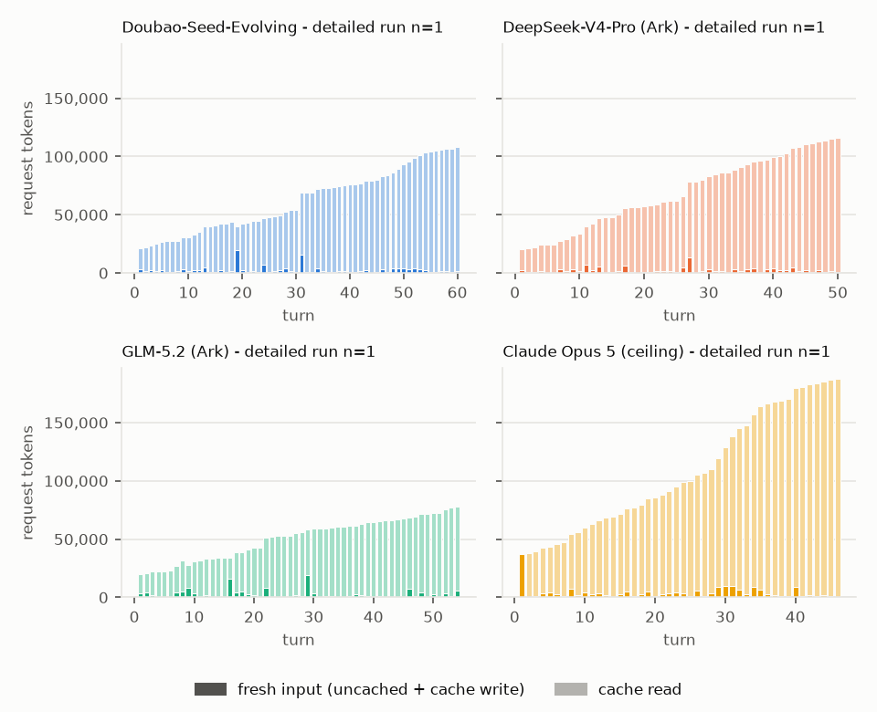
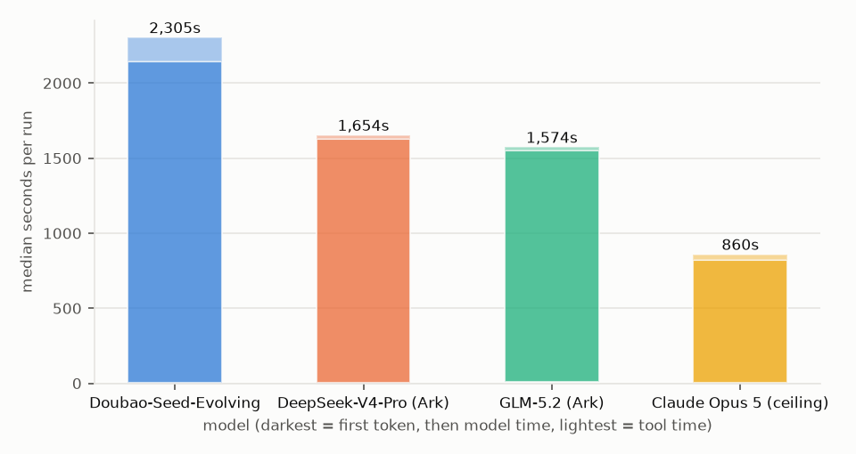

# Summary (2026-09-11) - 8 runs (8 baseline, 0 weekly)

Medians per model x prompt (tokens are per run; input = uncached input tokens). check-13 = share of runs that flagged the slide-7 CAC conflict; visual QA = share of runs that exported the deck to images and read them back.

| model | prompt | runs | median checks (of 13) | median cost USD | median wall s | median turns | median input tok | median cache-read tok | median output tok | median peak request tok | check-13 pass rate | visual QA rate |
|---|---|---|---|---|---|---|---|---|---|---|---|---|
| Doubao-Seed-Evolving | vague | 1 | 9 | 1.053 | 2,417 | 57 | 163,343 | 3,878,776 | 63,176 | 113,337 | 100% | 100% |
| Doubao-Seed-Evolving | detailed | 1 | 13 | 0.9823 | 1,932 | 60 | 151,807 | 3,584,288 | 60,371 | 108,047 | 100% | 100% |
| DeepSeek-V4-Pro (Ark) | vague | 1 | 7 | 0.387 | 2,308 | 29 | 95,621 | 1,500,160 | 53,944 | 88,757 | 100% | 0% |
| DeepSeek-V4-Pro (Ark) | detailed | 1 | 13 | 0.5714 | 985 | 50 | 115,194 | 3,352,064 | 75,662 | 115,912 | 100% | 0% |
| GLM-5.2 (Ark) | vague | 1 | 7 | 0.5557 | 2,080 | 27 | 86,037 | 1,086,720 | 39,697 | 64,781 | 100% | 0% |
| GLM-5.2 (Ark) | detailed | 1 | 13 | 1.059 | 1,048 | 54 | 138,303 | 2,607,872 | 44,669 | 77,551 | 100% | 0% |
| Claude Opus 5 (ceiling) | vague | 1 | 8 | 6.325 | 1,290 | 53 | 106 | 5,598,231 | 69,509 | 178,807 | 100% | 100% |
| Claude Opus 5 (ceiling) | detailed | 1 | 13 | 6.061 | 1,026 | 46 | 92 | 4,771,165 | 70,645 | 187,371 | 100% | 100% |

## Every run

| run | checks | c13 | visual QA | cost USD | wall s | turns | input tok | cache-read tok | output tok | notes |
|---|---|---|---|---|---|---|---|---|---|---|
| deepseek/detailed/1 | 13 | True | False | 0.5714 | 985.0 | 50 | 115194 | 3352064 | 75662 |  |
| deepseek/vague/1 | 7 | True | False | 0.387 | 2308.1 | 29 | 95621 | 1500160 | 53944 | c07: missing sheets ['unit_economics', 'dcf', 'loan']; c08: NPV missing; c09: IRR missing; c10: total interest missing; c12: only 4 model.xlsx metrics appear on slides: ['CAC', 'LTV', 'payback', 'ARPA'] |
| evolving/detailed/1 | 13 | True | True | 0.9823 | 1932.1 | 60 | 151807 | 3584288 | 60371 |  |
| evolving/vague/1 | 9 | True | True | 1.0531 | 2416.8 | 57 | 163343 | 3878776 | 63176 | c07: missing sheets ['unit_economics', 'dcf', 'loan']; c08: NPV missing; c09: IRR missing; c10: total interest missing |
| glm/detailed/1 | 13 | True | False | 1.0591 | 1048.3 | 54 | 138303 | 2607872 | 44669 |  |
| glm/vague/1 | 7 | True | False | 0.5557 | 2079.5 | 27 | 86037 | 1086720 | 39697 | c07: missing sheets ['dcf', 'loan']; c08: NPV missing; c09: IRR missing; c10: total interest missing; c12: only 4 model.xlsx metrics appear on slides: ['CAC', 'LTV', 'payback', 'ARPA'] |
| opus/detailed/1 | 13 | True | True | 6.0614 | 1026.3 | 46 | 92 | 4771165 | 70645 |  |
| opus/vague/1 | 8 | True | True | 6.3254 | 1290.0 | 53 | 106 | 5598231 | 69509 | c07: missing sheets ['dcf', 'loan']; c08: NPV missing; c09: IRR missing; c10: total interest missing; c12: only 4 model.xlsx metrics appear on slides: ['CAC', 'LTV', 'payback', 'ARPA'] |
